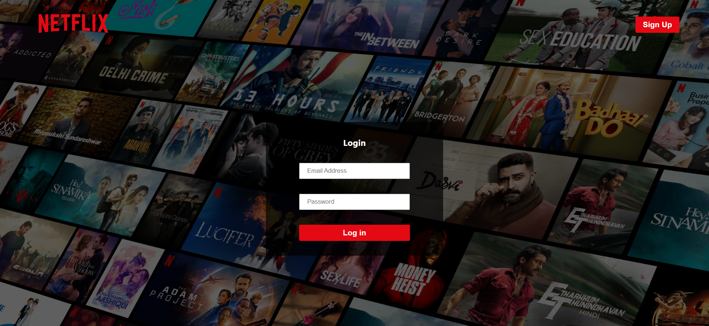
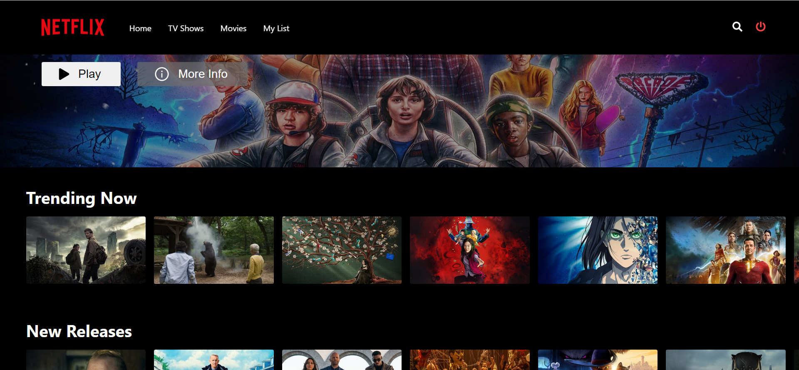

# Web-Stream Application - Frontend Repo 

Web-stream is a Web Application created using ReactJS which can be used for streaming movies, tv shows, etc. just like Netflix.

This repository contains the source code of the frontend (UI) of this webapp.

The source code for the backend of the application is present [here](https://github.com/muskanmi/netflix-clone-backend).

***Note:*** This application looks like a clone of Netflix but is neither an exact replica of it nor is associated with it directly.







## Features:

- **User Authentication:** User can signup on the platform to explore the vast variety of movies, tv shows, etc. (User authentication is being performed with the help of Firebase in this application.)
- Users can **browse** over a wide variety of shows, movies and series and explore them category wise as well.
- Users can also **filter** the content by different *Genres*.
- It also provides users ability to add their favorite shows & movies to their **watch list**.


## Tools & Technology Used:

- React.js
- NodeJS
- ExpressJs
- HTML
- CSS
- Javascript
- Redux
- Toolkit
- MongoDB
- Firebase
- Web APIs


## Prerequisites:

* React Version: **18.2.0**
* Node Version: **18.14.1**
* NPM Version: **9.5.0**
* You need to be registered with the TMDB website and have an API key generated in your account.
* You also need to have an account on Firebase's website and have a project created on it.


## Instructions:

Before proceeding with the steps for running this application, you need to start the backend server by following the instructions present in the [backend repo](https://github.com/muskanmi/netflix-clone-backend).

You can now follow the below steps to run this application in your system's local environment:

1. Get the source code on your pc via git.

    ```shell
    git clone https://github.com/muskanmi/netflix-clone-frontend
    ```

2. Now, navigate inside the folder through your terminal.

    ```shell
    cd netflix-clone-frontend
    ```

3. Create a directory named as `utils` inside the **src** directory present at the root of the repo.

4. Next, you need to create a configuration file named as `constants.jsx` inside the `utils` directory for authenticating with **TMDB's API**.

5. Enter the following statements after adding the value of **TMDB API key** in this newly created `constants.jsx` file:

    ```js
    export const API_KEY = "";
    export const TMBD_BASE_URL = "https://api.themoviedb.org/3"
    ```

6. Then, you need to create another configuration file named as `firebase-config.js` inside the `utils` directory for providing the configuration details of the **Firebase** project.

7. Add the following statements in this newly created `firebase-config.js` file and use your firebase project information to fill the relevant config information:

    ```js
    import { initializeApp } from "firebase/app";
    import { getAuth } from "firebase/auth";
    const firebaseConfig = {
      apiKey: "",
      authDomain: "",
      projectId: "",
      storageBucket: "",
      messagingSenderId: "",
      appId: "",
      measurementId: ""
    };
    const app = initializeApp(firebaseConfig);

    export const firebaseAuth = getAuth(app);
    ```

9. Now, install the required dependencies by running the following command:

    ```shell
    npm install
    ```

9. Finally, start the application by running:

    ```shell
    npm start
    ```

10. Voila! the web-streaming application is ready for use. You can run it at http://127.0.0.1:3000/


#### :small_blue_diamond: Please do give a ⭐️ if you find this project useful.
